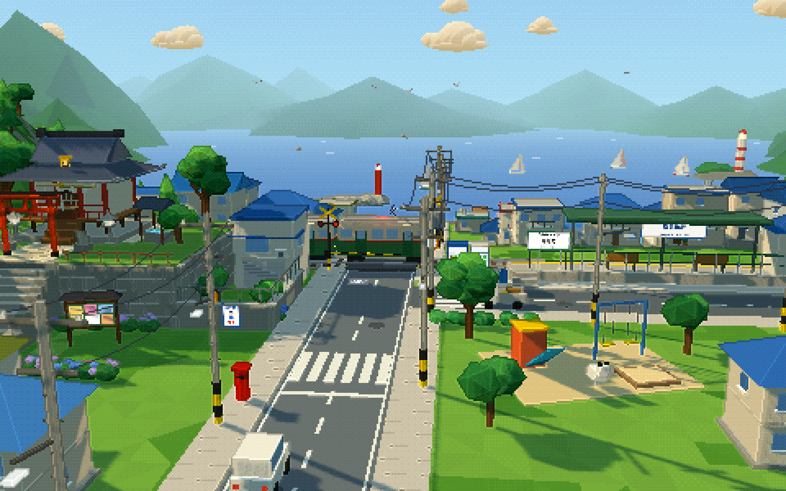
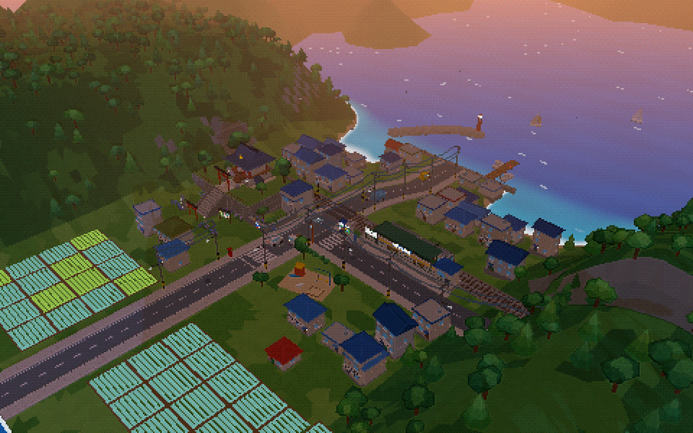
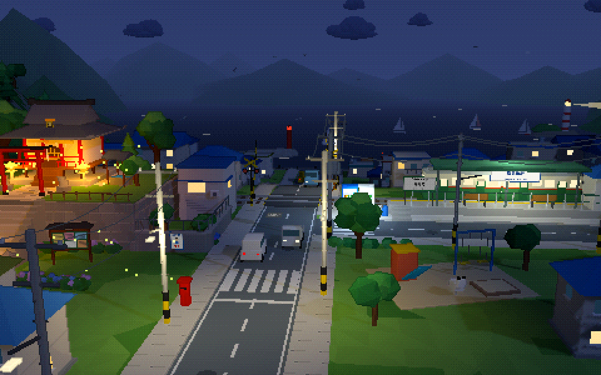
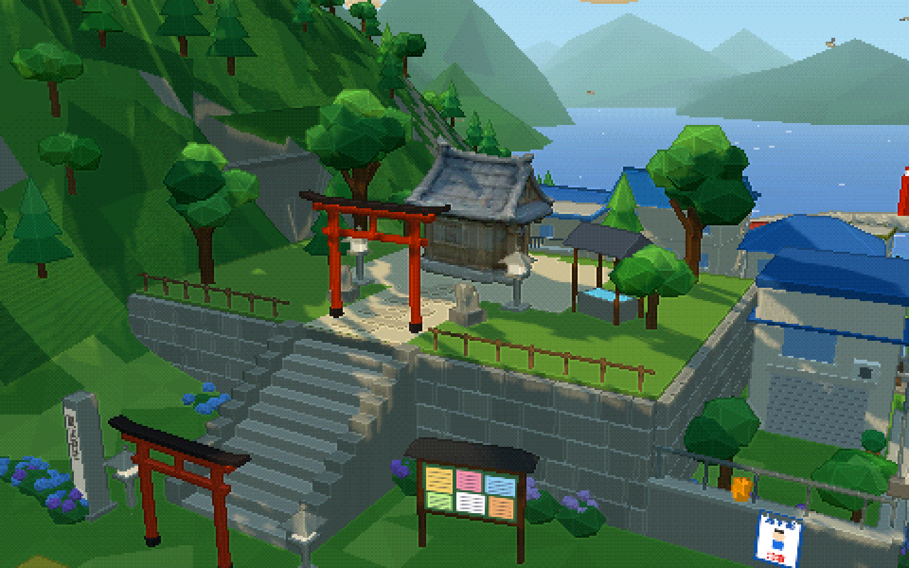
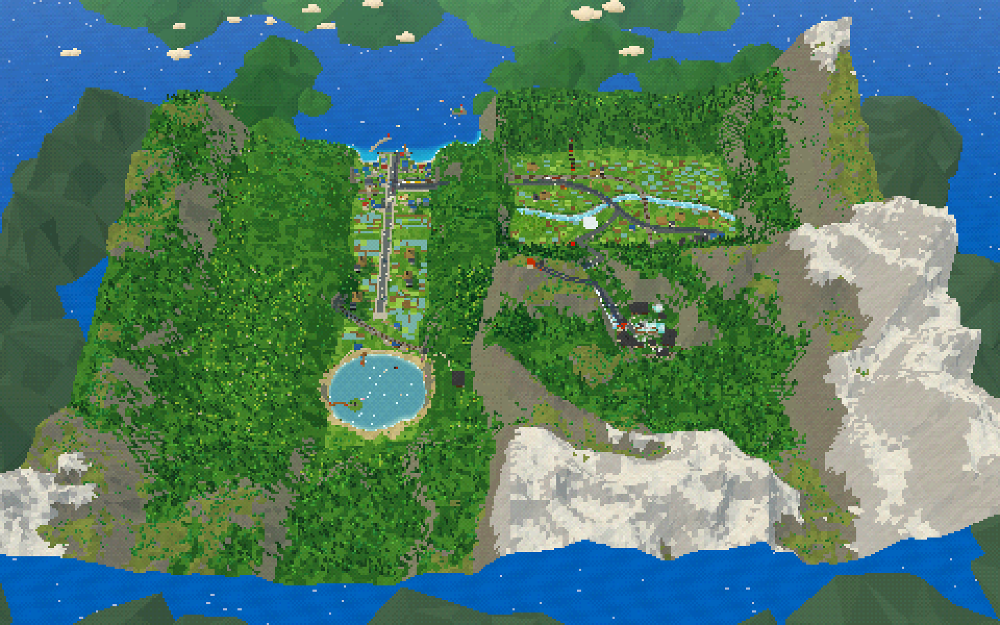
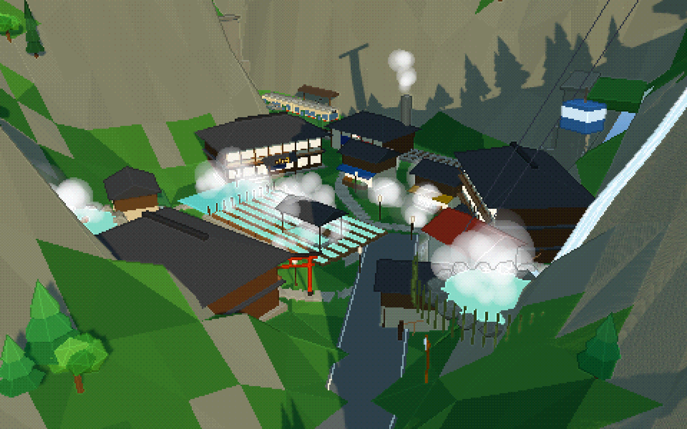
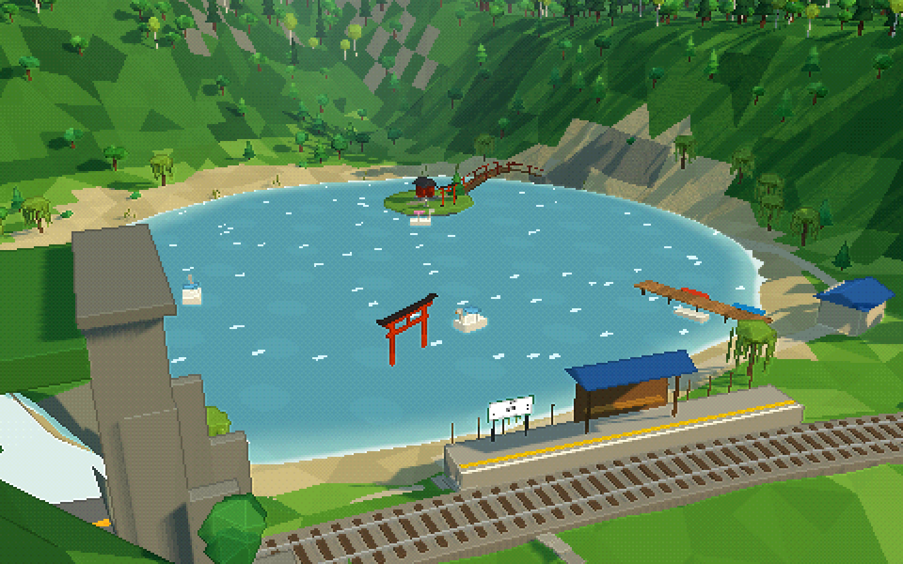
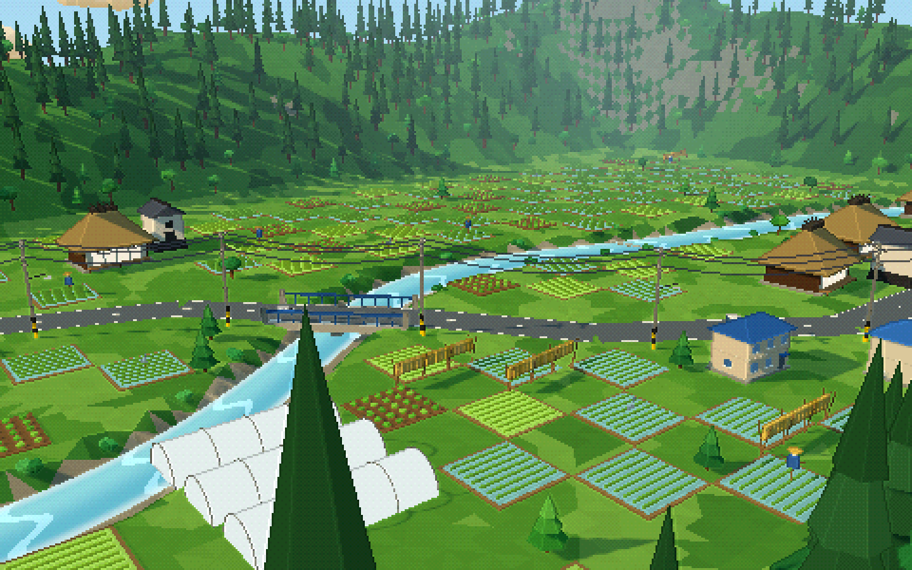
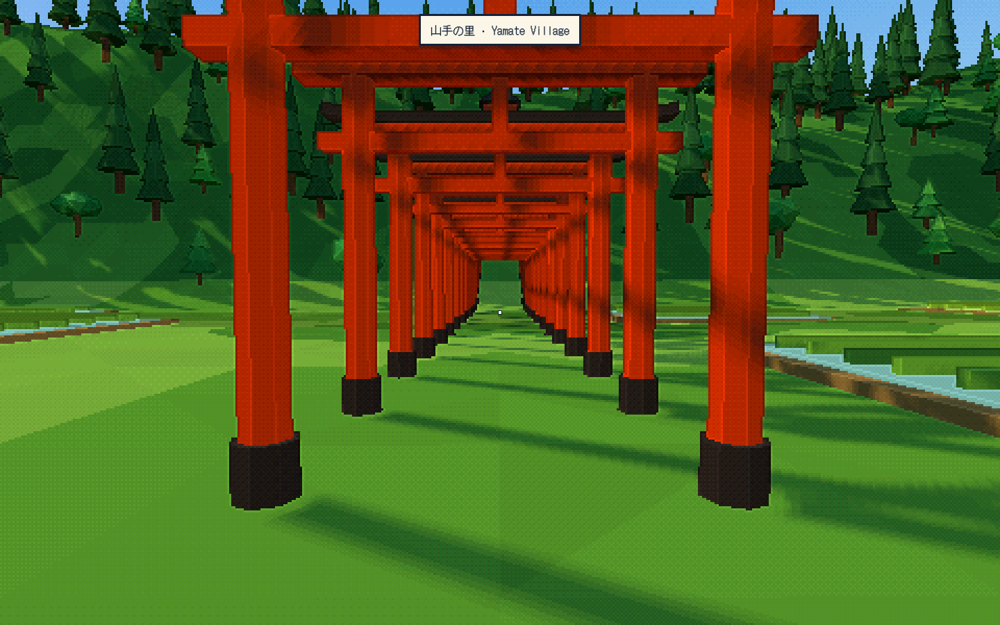
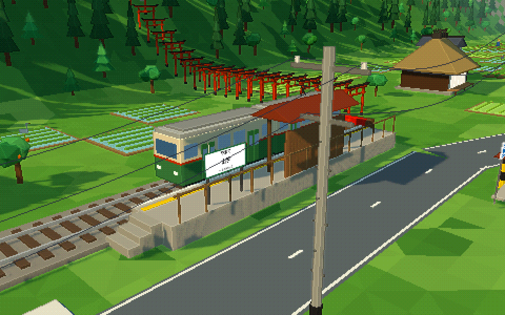

# Pixel Town 3D Asset Pipeline POC



## Umimi-chō: the town diorama

`index.html` is a full browser diorama of the source panorama
(`assets/source/panorama.png`), rendered as 3D pixel art:

- shrine terrace with torii, stone lanterns, komainu and hydrangeas
- level crossing whose barriers drop for a two-car tram that runs between
  two tunnels and stops at the station
- traffic that waits at the crossing, harbour with jetty and breakwater,
  sailboats, gulls, rice paddies, utility poles with sagging wires
- a 24h day/night cycle: lit windows, lanterns, fireflies, a lighthouse
  beam, stars
- low-res render + depth/normal edge pass + ordered dither, upscaled with
  nearest filtering
- one button swaps the procedural shrine for the TripoSR pipeline asset
  (`shrine_01_simple_clean.glb`), so generated assets can be judged in context
- optional synthesised soundscape (surf, cicadas, crickets, crossing bell)
- **Yamate (山手)**: road B climbs through the Yamate tunnel into a farming
  valley: thatched minka and kura, paddies with drying racks and scarecrows,
  a river with a water wheel, bridge and egrets, greenhouses, a bamboo grove,
  a path of a thousand torii, a temple with a three-storey pagoda, cedar forest,
  and a community bus that drives between the town and the valley
- **first-person walking** (`F` or the Walk button): WASD + mouse look,
  Shift to run; on phones, left thumb walks and right thumb looks. You follow
  stairs, the platform, the tunnels and the bridge; buildings and water block you
- **one enclosed world**: mountains ring every land edge, the bay is closed by
  headlands, and a railway loop links all of it:
  Umimi-chō → Yamate → river bridge → level crossing → up to the onsen →
  a long tunnel west → the lake → back into town. Two trams run it, with
  tunnels, bridges and cuttings worked out automatically from the terrain
- **山の湯温泉 onsen village** in a high basin, up a switchback road with
  guardrails and curve mirrors: inns, a steaming yubatake (hot-water field),
  rock pools with snow monkeys, a foot bath, a bathhouse, a waterfall with a
  suspension bridge, a ropeway to a summit shrine, and a mountain tea house
- **湖畔 lake** south of town: swan boats and rowboats, a pier, a shrine
  island with a red arched bridge, a torii standing in the water, a lakeside
  inn, willows and reeds, and farmland along the road from town
- **small details**: winding footpaths from every house to the road and out
  to the fields, roadside shrines (hokora), unmanned vegetable stands,
  bicycles and mailboxes
- (earlier) the tram shuttled between Umimi-chō and a little country halt, 山手駅
  (Yamate station): it climbs through the east railway tunnel (which you can
  walk through too) and comes out beside the road tunnel in the valley
- the tram's doors slide open at both platforms; railway and road tunnels are
  arched tubes with stone portals and sodium lamps; swings and power lines
  sway in the breeze

Run: `python3 scripts/serve.py 8010`, then open `http://localhost:8010`
(it disables caching so phones never mix stale modules).

Viewport log: the page posts its camera state (position, heading, zone, time,
tram) to `logs/latest.json` and `logs/viewport.jsonl` whenever the view changes.
`B` or 🚩 flags a view with a note and screenshot into `logs/flags/`. Every
entry has a `link` with `#view=…` that reopens that exact viewpoint. Add `?lite` for a
lighter build; touch devices get it automatically.
Keys: `1-9` cameras (7 Onsen, 8 Lake, 9 Map), `F` walk, `V` fly (WASD, `R` up, `F` down, Shift fast), `N` day/night, `T` hurry the tram, `[ ]` pixel size,
`H` hide UI, `P` save a postcard PNG, `space` pause time.

The previous single-asset viewer (rotation controls) now lives at
`shrine-viewer.html`.

| Dusk | Night | TripoSR shrine in place |
| --- | --- | --- |
|  |  |  |

| World map | Onsen | Lake |
| --- | --- | --- |
|  |  |  |

| Yamate valley | Walking the torii path | Tram doors open |
| --- | --- | --- |
|  |  |  |

Code: `src/main.js` composes the scene; `src/town/` holds the modules
(terrain + sea shader, sky, buildings, props, tunnels, the Yamate valley in
`rural.js`, life/traffic, first-person `walk.js`, pixel pass, audio). Static geometry is merged per material bucket by
`src/town/batcher.js`, so the whole town is a handful of draw calls.

---

This project is a proof of concept for turning a generated pixel-art seaside
town panorama into a stylised 3D world through a staged, testable asset
pipeline.

The current checkout is an **automation scaffold plus a basic browser scene**,
not yet a complete browser world. It focuses on scene parsing, asset routing,
clean intermediate asset generation, cleanup, and loading one approved asset at
a time into Three.js.

The project direction is deliberately hybrid:

- use the panorama as source art and layout reference,
- parse the scene into candidate objects,
- route each object to an appropriate generation path,
- generate or model assets one-by-one,
- clean and normalise assets,
- place approved assets into a browser-rendered scene.

The goal is not a single-shot conversion of one image into a perfect 3D scene.
The goal is a pragmatic workflow that can be reviewed, tested, and improved in
small steps.

## Current Repository Shape

```text
pixel-town-poc/
  index.html
  assets/
    scene_parse.json
    asset_routes.json
    intermediate/
      shrine_01_clean.txt
      shrine_01_clean_meta.json
    generated/
      shrine_01_raw.glb
      shrine_01_generation_meta.json
      shrine_01_notes.md
  docs/
    AUTOMATED_HYBRID_WORKFLOW.md
    SCRIPT_INTERFACES.md
    Pixel_Town_3D_POC_Handoff.md
  scripts/
    parse_scene.py
    route_assets.py
    generate_clean_asset_image.py
    run_image_to_3d_asset.py
    cleanup_glb_asset.py
  src/
    main.js
```

`index.html` now loads a small Three.js viewer from `src/main.js`. Serve the
folder over HTTP and open the local URL in a browser to inspect the cleaned
shrine asset with lightweight procedural roads and trees.

## Implemented Now

- Stub scene parser that emits a starter object inventory.
- Stub asset router that assigns each object to a generation strategy.
- Stub clean-asset-image generator that writes prompt metadata and a placeholder
  text artifact, and can write a real source crop PNG.
- Real TripoSR backend hook for `scripts/run_image_to_3d_asset.py`.
- Sample TripoSR-generated outputs for `shrine_01`.
- Cleanup/normalisation for generated GLBs while preserving vertex colors.
- Basic Three.js scene that loads `assets/generated/shrine_01_simple_clean.glb`
  and adds procedural roads/trees around it.
- Script interface documentation in `docs/SCRIPT_INTERFACES.md`.

## Not Implemented Yet

- Real VLM scene parsing.
- Real image generation for clean intermediate asset images.
- Blender-grade cleanup, retopology, or decimation.
- Real scene composition and placement against the source panorama.
- Production-quality clean asset generation.

## Recommended Hybrid Pipeline

The recommended path for visually distinctive assets is:

1. Parse the scene into object records with IDs, names, descriptions, rough
   locations, complexity, occlusion, and priority.
2. Use each object record plus source-scene context to generate a clean isolated
   3D-style concept image of that object.
3. Feed that clean concept image into an image-to-3D backend.
4. Review, clean, normalise, and only then place the mesh into the world.

This is the preferred branch for assets like `shrine_01` because direct crops
contain background, stairs, trees, and adjacent props. The tradeoff is drift:
the generated clean image can become prettier but less faithful to the source,
so every clean image needs human review before 3D generation.

There is also a parallel direct route under investigation:

```text
object metadata -> reviewed 3D prompt -> prompt-to-3D backend -> cleanup -> browser
```

See `docs/DIRECT_PROMPT_TO_3D_OPTIONS.md` for local and paid backend options.

### 1. Parse the scene

```bash
python3 scripts/parse_scene.py \
  --image assets/source/panorama.png \
  --out assets/scene_parse.json
```

The `--image` path is validated and used to add pixel-space bounding boxes when
present.

### 2. Route assets

```bash
python3 scripts/route_assets.py \
  --scene assets/scene_parse.json \
  --out assets/asset_routes.json
```

Allowed route values are:

- `procedural`
- `direct_crop_to_i23d`
- `clean_render_then_i23d`
- `prompt_to_3d_direct`
- `multiview_then_i23d`
- `manual_model`

### 3. Generate a clean intermediate asset image

```bash
python3 scripts/generate_clean_asset_image.py \
  --asset shrine_01 \
  --scene assets/scene_parse.json \
  --mode clean-render \
  --outdir assets/intermediate
```

The current implementation writes:

- `assets/intermediate/shrine_01_clean.png`
- `assets/intermediate/shrine_01_clean.txt`
- `assets/intermediate/shrine_01_clean_meta.json`

The PNG is currently a crop from the source panorama, not a fully isolated
generated clean render. The next version should use the parsed object record as
prompt context and generate a background-free, single-object concept render.

### 4. Run image-to-3D

```bash
python3 scripts/run_image_to_3d_asset.py \
  --asset shrine_01 \
  --scene assets/scene_parse.json \
  --routes assets/asset_routes.json \
  --mode clean-render \
  --backend stub \
  --outdir assets/generated
```

The current implementation writes:

- `assets/generated/shrine_01_raw.glb`
- `assets/generated/shrine_01_raw_input.png`
- `assets/generated/shrine_01_generation_meta.json`
- `assets/generated/shrine_01_notes.md`

With `--backend stub`, the GLB is a placeholder byte file. With
`--backend tripo`, the GLB is generated by a local TripoSR checkout.

Example TripoSR run:

```bash
python3 scripts/run_image_to_3d_asset.py \
  --asset shrine_01 \
  --scene assets/scene_parse.json \
  --routes assets/asset_routes.json \
  --mode clean-render \
  --backend tripo \
  --outdir assets/generated \
  --tripo-repo /tmp/triposr-run \
  --tripo-python /tmp/triposr-venv/bin/python \
  --device cpu \
  --mc-resolution 128 \
  --chunk-size 4096
```

Current first-run result: TripoSR produces a valid GLB for `shrine_01`, but the
mesh mostly captures the shrine roof mass. A cleaner isolated input image is the
next quality lever.

Current best browser-asset candidate:

- `assets/intermediate/shrine_01_simple_concept.png`
- `assets/generated/shrine_01_simple_clean.glb`
- `assets/generated/shrine_01_simple_preview.png`

This simpler concept is less ornate and more source-faithful than the first
generated concept. The cleaned GLB is grounded, centered, scaled, and preserves
TripoSR vertex colors. Its final browser rotation is stored in
`assets/generated/shrine_01_simple_cleanup_meta.json` as X `-90`, Y `0`, Z
`45` degrees.

### 5. Preview in Three.js

```bash
python3 scripts/serve.py 8010
```

Then open:

```text
http://localhost:8010
```

The viewer uses CDN-hosted Three.js modules, loads the cleaned shrine GLB,
enables vertex colors on imported meshes, adds orbit controls, and provides a
small ground/grid reference plus procedural shrine-context roads and trees.
Press `R` in the browser to reset the camera.

### 6. Trialed: direct parametric GLB

For simple describable objects, the direct route skips image generation and
builds a small local GLB from object metadata:

```bash
python3 scripts/run_prompt_to_3d_asset.py \
  --asset vending_machine_01 \
  --scene assets/scene_parse.json \
  --routes assets/asset_routes.json \
  --backend parametric \
  --outdir assets/generated
```

The current parametric backend writes:

- `assets/generated/<asset_id>_prompt3d_raw.glb`
- `assets/generated/<asset_id>_prompt3d_prompt.txt`
- `assets/generated/<asset_id>_prompt3d_generation_meta.json`
- `assets/generated/<asset_id>_prompt3d_notes.md`

Current decision: these parametric assets are not good enough for the browser
world direction, so they are not loaded in the active viewer. Keep the route as
a possible future baseline or test fixture, but prioritise cleaner
image-to-3D/cleanup output instead.

## Human Checkpoints

Human review should happen at these points:

1. Scene inventory review: confirm object names, categories, priorities, and
   approximate bounding boxes.
2. Routing review: confirm which objects should be procedural, AI-generated, or
   manually modelled.
3. Clean intermediate review: decide whether generated isolated images still
   match the source object.
4. Post-3D review: inspect silhouette, mesh quality, scale, and style once a
   real backend is connected.
5. In-world review: inspect whether approved assets feel correct in the browser
   scene.

Future automation should keep these as explicit gates rather than silent
decisions: confirm the object inventory, confirm generated prompts, approve
clean concept images, then approve or reject generated meshes. See
`docs/AUTOMATED_HYBRID_WORKFLOW.md`.

## Recommended First Experiments

Use these assets for early A/B testing:

- `shrine_01`
- `house_blue_01`
- `vending_machine_01`

Compare:

- direct crop to image-to-3D,
- clean render to image-to-3D,
- manual or procedural fallback.

## Near-Term Next Steps

1. Build the generic reviewed-inventory and prompt-manifest flow described in
   `docs/AUTOMATED_HYBRID_WORKFLOW.md`.
2. Add a generic scene-placement manifest so future approved assets can be
   positioned without hard-coding `shrine_01`.
3. Add validation so placeholder GLB files cannot be mistaken for production
   assets.
4. Replace the source-crop clean image with a generated isolated asset image.
